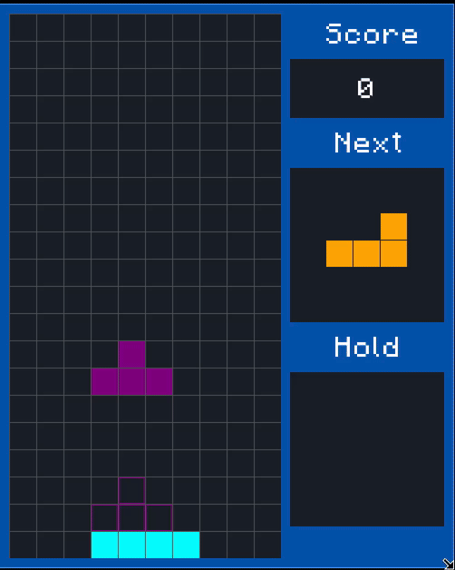

# Raylib Tetris

A small Tetris-style game written in C++ with [raylib](https://www.raylib.com/).



## Features

- Seven standard tetrominoes with rotation
- Next-piece and hold-piece previews
- Ghost piece showing where the current piece will land
- Soft drop and hard drop
- Line clearing and score tracking
- Game-over screen with restart
- Minecraft font and a simple dark-blue/gray interface

## Controls

| Key | Action |
| --- | --- |
| Left / Right arrows | Move the piece |
| Up arrow | Rotate |
| Down arrow | Soft drop |
| Space | Hard drop |
| C | Hold or swap the current piece |
| Any key after game over | Restart |

## Setup

### Requirements

- A C++17 compiler
- [CMake](https://cmake.org/) 3.16 or newer
- [Ninja](https://ninja-build.org/)
- A system with raylib's desktop dependencies

On Ubuntu or Debian:

```bash
sudo apt update
sudo apt install build-essential cmake ninja-build libgl1-mesa-dev xorg-dev
```

On macOS, install CMake and Ninja with [Homebrew](https://brew.sh/):

```bash
brew install cmake ninja
```

On Windows, install Visual Studio with the **Desktop development with C++** workload, plus CMake and Ninja.

## Build and run

Clone the repository and its raylib submodule:

```bash
git clone --recurse-submodules https://github.com/muntalee/raylib-tetris.git
cd raylib-tetris
```

Then build and start the game:

```bash
make run
```

The executable is created at `build/tetris` on Linux and macOS, or `build/tetris.exe` on Windows.

To build without running:

```bash
make compile
```

To remove generated build files:

```bash
make clean
```

If the repository was cloned without submodules, initialize raylib with:

```bash
git submodule update --init --recursive
```

## Project layout

- `src/` - game and rendering code
- `include/` - project headers
- `data/` - fonts and other game assets
- `extern/raylib/` - raylib dependency
- `CMakeLists.txt` and `Makefile` - build configuration

## License

This project is available under the terms of the [LICENSE](LICENSE) file.
